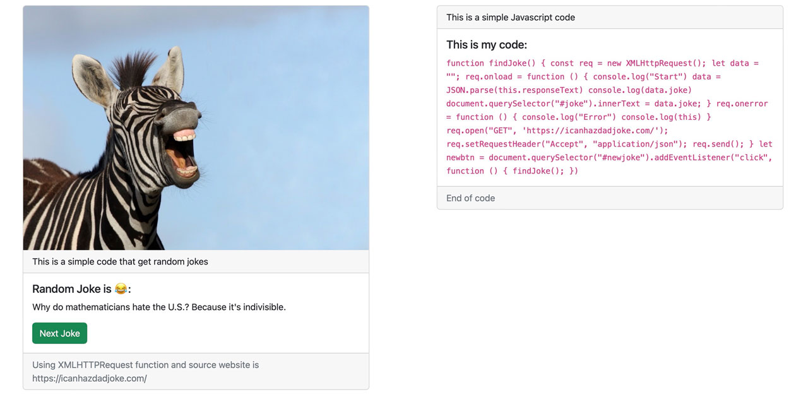

<div>
  <h1 align="center">Random Joke is a Javascript Project 🧑‍💻</h1>
  <h2 align="center"> A pratice for XMLHttpRequest</h2>
<h3>Goals</h3>
  <ul>
  <li>
    Handle XMLHttpRequest()
  </li>
  <li>
    Practicing addEventListener()
  </li>
  <li>
    Practicing querySelector()
  </li>

   </ul>

  <p>
    Screenshot:
  </p>

  <a href="">
    
  </a>
</div>

<hr />

## API
- API Provided by : https://icanhazdadjoke.com/

## Requirements
- Javascript

## Main Part

- findjoke()


```javascript
findJoke();

function findJoke() {
    const req = new XMLHttpRequest();

    let data = "";
    req.onload = function () {
        console.log("Start")
        data = git(this.responseText)
        console.log(data.joke)
        document.querySelector("#joke").innerText = data.joke;
    }
    req.onerror = function () {
        console.log("Error")
        console.log(this)
    }

    req.open("GET", 'https://icanhazdadjoke.com/');
    req.setRequestHeader("Accept", "application/json");
    req.send();
}
let newbtn = document.querySelector("#newjoke").addEventListener("click", function () {
    findJoke();
})

```
# Just open index.html with a browser